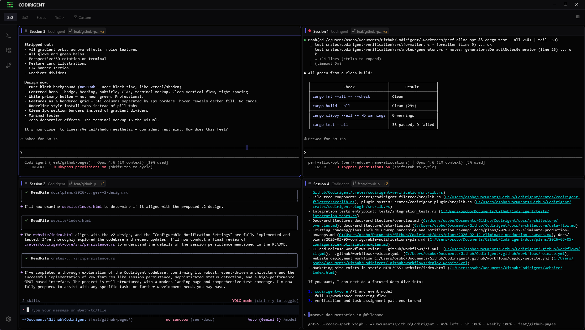
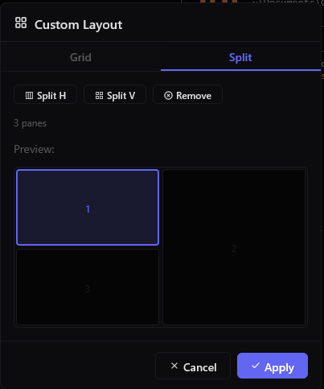
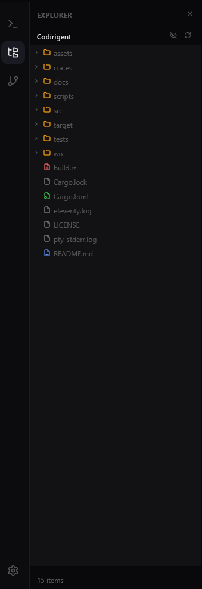
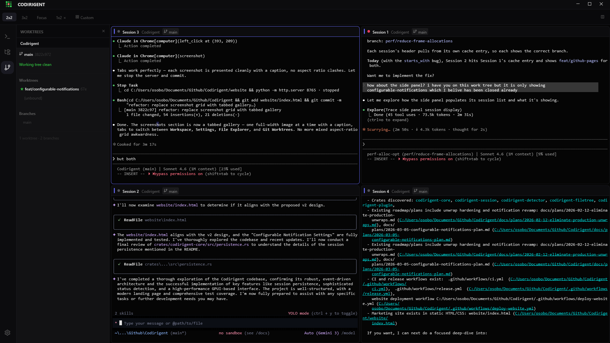

<p align="center">
  
</p>

<h1 align="center">Codirigent</h1>

<p align="center">
  <strong>A terminal workspace for running multiple AI coding CLIs in parallel</strong>
</p>

<p align="center">
  
  
  
  
</p>

<p align="center">
  <a href="https://codirigent.dev">Website</a> ·
  <a href="https://github.com/oso95/Codirigent/releases/latest">Download</a> ·
  <a href="https://github.com/oso95/Codirigent/issues">Report a Bug</a>
</p>

---

<video src="website/video/demo.mp4" autoplay loop muted playsinline width="100%"></video>

---

If you're running Claude Code, Codex, or Gemini across multiple projects at the same time, you know the pain: opening terminals, `cd`-ing into repos, arranging windows, losing track of which agent is doing what.

Codirigent is a Tmux-style workspace built for this workflow. Open it once, and your sessions are already where you left them — right directory, right layout, right agent.

## Features



**Multiple sessions, one view** — run Claude Code, Codex, and Gemini side by side. Status indicators show which agent is Working, Needs Attention, or Idle.

---



**Custom layouts** — arrange sessions in any grid configuration and save them. Restore your exact setup instantly.

---



**Synced file tree** — the file explorer always reflects whichever session is focused, so you always know where you are.

---



**Git worktree support** — run agents on isolated branches simultaneously without conflicts.

## Download

> **Early alpha** — expect rough edges. [Feedback welcome.](https://github.com/oso95/Codirigent/issues)

### Windows

Download the `.msi` installer from the [latest release](https://github.com/oso95/Codirigent/releases/latest).

> **SmartScreen warning:** Windows may show "Windows protected your PC" since the app is not yet code-signed. Click **More info → Run anyway** to proceed.

### macOS

Download the `.dmg` from the [latest release](https://github.com/oso95/Codirigent/releases/latest).

> **Gatekeeper warning:** macOS code signing is pending Apple Developer approval. To open: right-click the app → **Open** → **Open** again.

## Build from Source

**Prerequisites:** Rust 1.75+, Windows or macOS

```bash
git clone https://github.com/oso95/Codirigent.git
cd Codirigent
cargo run --all-features
```

> Linux support is not yet complete.

## Development

```bash
cargo test --all --all-targets        # run tests
cargo fmt --all                       # format
cargo clippy --all -- -D warnings     # lint
```

## Contributing

Open an issue before major changes. PRs welcome.

## License

GPL-3.0 — see [LICENSE](LICENSE).
